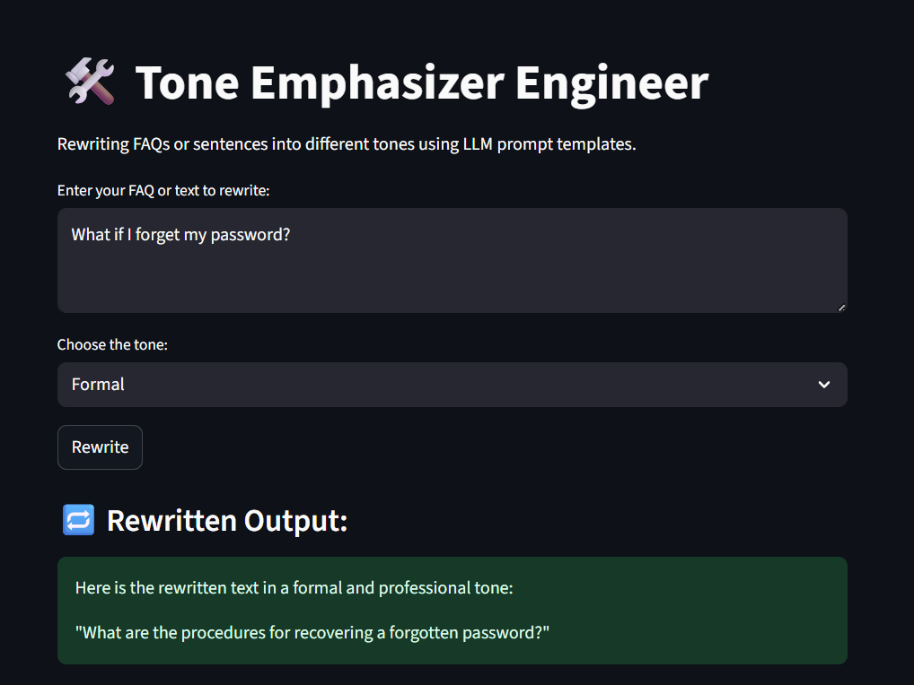
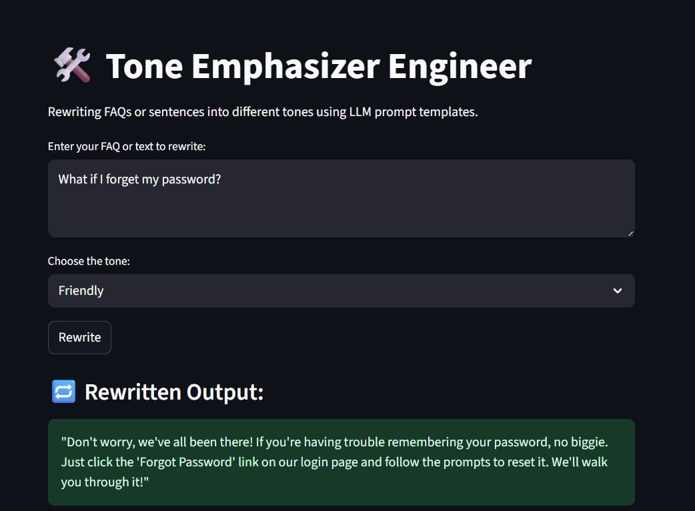
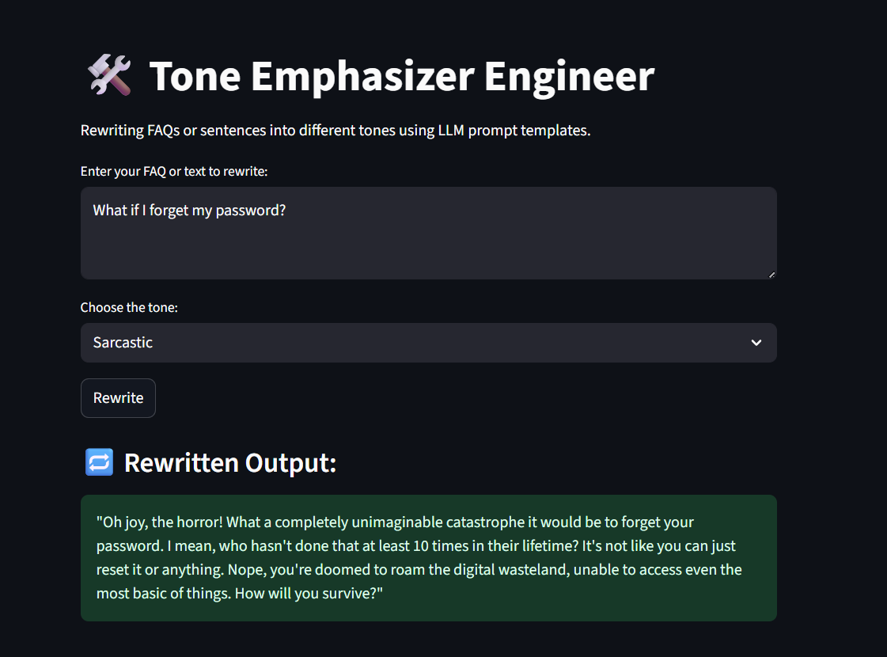

🦙 Powered by LLaMA 3.1 (8B) via Ollama
This project uses Meta's LLaMA 3.1 model entirely locally through Ollama.
This project is part of a learning series to build hands-on LLM projects.  
**Mini Prompt Engineer** is a Streamlit-based app that helps you rewrite any input text (like FAQs, chatbot responses, or sentences) into different tones using carefully crafted **prompt templates** and a language model.

---

## ✨ Features

- 🔁 Rewrites text into 5+ tones using prompt templates
- 🧠 Runs fully **offline** with Meta’s LLaMA 3.1 via Ollama
- 🛠️ Modular design (prompt logic, LLM interface, UI all separate)
- 🧪 Lightweight and ideal for prompt engineering practice
- 🖼️ Interactive interface using Streamlit

---

## 🚀 What It Looks Like

| Input | Tone | Rewritten Output |
|-------|------|------------------|
| "What if I forget my password?" | Formal | ""What are the procedures for recovering a forgotten password?"" |
| "What if I forget my password?" | Friendly | "Don't worry, we've all been there! If you're having trouble remembering your password, no biggie. Just click the 'Forgot Password' link on our login page and follow the prompts to reset it. We'll walk you through it!" |
| "What if I forget my password?" | Sarcastic | "Oh joy, the horror! What a completely unimaginable catastrophe it would be to forget your password. I mean, who hasn't done that at least 10 times in their lifetime? It's not like you can just reset it or anything. Nope, you're doomed to roam the digital wasteland, unable to access even the most basic of things. How will you survive?" |

---

## 🧠 Why This Project?

As an aspiring prompt engineer or LLM tinkerer, it's important to:
- Understand how **prompt phrasing** affects output tone
- Learn to **modularize prompts**
- Build lightweight apps that test and showcase prompt templates

This project helps you do all three 💪

📦 Setup Ollama + Model

# Install Ollama (if not already installed)
# https://ollama.com/download

# Pull the LLaMA 3.1 8B model
ollama run llama3
This spins up the local model server at http://localhost:11434.

🧰 Installation

# Clone the repo
git clone https://github.com/your-username/mini_prompt_engineer.git
cd mini_prompt_engineer

# Create and activate virtual environment
python -m venv venv
source venv/bin/activate  # or venv\Scripts\activate on Windows

# Install dependencies
pip install -r requirements.txt
▶️ Run the App
Start your Ollama model (if not already running):

ollama run llama3
Then launch the app:

streamlit run app.py
Open your browser and go to: http://localhost:8501

💡 Use Cases
Rewriting chatbot responses with tone control

Testing prompt engineering templates

Enhancing FAQ documents for different audiences

Practicing LLM prompt + response formatting

📚 Learning Outcomes
✅ Understand prompt templating
✅ Use LLMs offline for controlled outputs
✅ Build a real-world prompt-testing tool
✅ Explore tone transformation and context control

## 📸 Screenshots

🙌 Credits
Built by Pranav 💻🦙
Powered by LLaMA 3.1 via Ollama and Streamlit.
Prompt engineering meets practicality!

⭐️ Like this?
Give it a star ⭐ on GitHub and build your own version with new tones, local models, or batch-processing for docs!