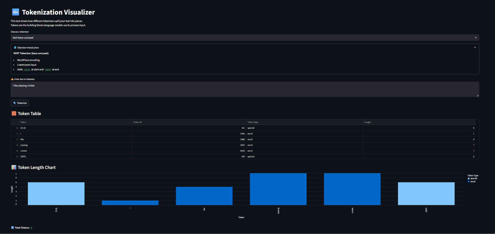
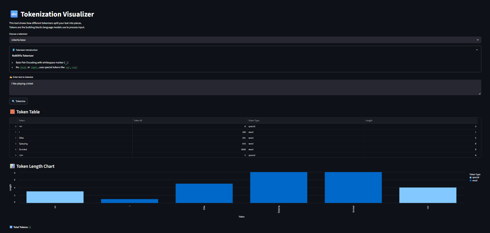
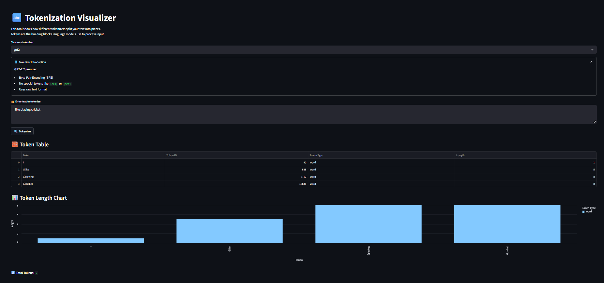

# 🔤 Tokenization Visualizer

Understand how LLMs "see" your text by visualizing how it is broken down into tokens — the fundamental units of input for models like GPT-2, BERT, RoBERTa, and LLaMA.

This beginner-friendly project helps demystify tokenization using Hugging Face tokenizers and an interactive Streamlit app. 

---

## 🎯 What You'll Learn

| Concept                  | Why It Matters                                        |
|--------------------------|--------------------------------------------------------|
| **Tokenization**         | Core step in converting text into something models understand |
| **Byte-Pair Encoding**   | Common subword technique used in GPT-style models     |
| **WordPiece / SentencePiece** | Used by BERT, RoBERTa, LLaMA — helps with rare words |
| **Token IDs**            | Models process token IDs, not words                   |
| **Prompt Efficiency**    | Knowing how tokenizers work = faster, cheaper, better prompts |

---

## ✨ Features

- 🧱 Tokenize any sentence using GPT2, BERT, RoBERTa, or LLaMA tokenizers
- 🧠 Short intro to each tokenizer type
- 📄 Table view: tokens, token IDs, and lengths
- 📊 Bar chart: token length visualization
- 🔢 Displays total number of tokens (great for prompt optimization)

---

## 📸 Screenshot

<sub></sub>
<sub></sub>
<sub></sub>
---

## 🧱 Project Structure

token_visualizer/
├── app.py # Streamlit frontend
├── utils/
│ └── tokenizer_utils.py # Token logic + tokenizer descriptions
├── requirements.txt # Dependencies
└── README.md # You're reading it!


---

## 🧪 Sample Output

**Input:**  
`I'm learning how LLMs tokenize text!`

**Tokenizer:** `GPT2`

| Token   | Token ID | Length |
|---------|----------|--------|
| I       | 40       | 1      |
| ’       | 821      | 1      |
| m       | 616      | 1      |
|  learning | 12166   | 9      |
| ...     | ...      | ...    |

📊 You’ll also see a bar chart of token lengths and a total count like:
🔢 Total Tokens: 11


---

## 🔧 Installation

```bash
# Clone this repo
git clone https://github.com/your-username/token_visualizer.git
cd token_visualizer

# Create virtual environment
python -m venv venv
source venv/bin/activate  # Windows: venv\Scripts\activate

# Install requirements
pip install -r requirements.txt

▶️ Run the App
Start the app locally with:

bash
Copy
Edit
streamlit run app.py
Then visit http://localhost:8501 in your browser.

🔁 Supported Tokenizers & Descriptions
| Tokenizer           | Description                                           |
| ------------------- | ----------------------------------------------------- |
| `gpt2`              | Byte-Pair Encoding (no special tokens)                |
| `bert-base-uncased` | WordPiece with lowercasing + special `[CLS]`, `[SEP]` |
| `roberta-base`      | GPT2-style with whitespace-aware tokens (▁ prefix)    |


Use the tokenizer explainer panel in the app to get bite-sized intros!

🧠 Why Tokenization Matters
"Language models don’t read words — they read tokens."

Tokenization affects:

💸 API cost (more tokens = more $$)

🧠 Context window length

🎯 Prompt formatting and accuracy

🧪 Fine-tuning and evaluation

Understanding it early sets you up for success in prompt engineering, RAG, and model deployment.

🤝 Credits
Built by Pranav 
Powered by:

🤗 Hugging Face Transformers

Streamlit

Altair


⭐ Like This Project?
Give it a ⭐ on GitHub and check out the next project:
